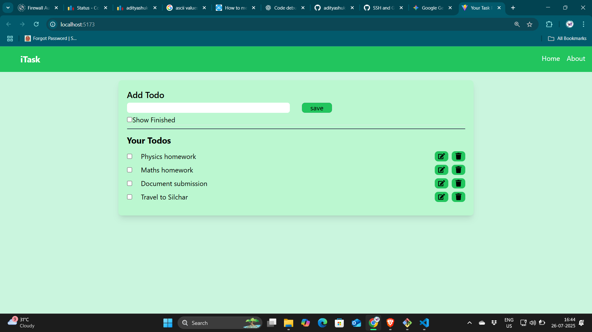
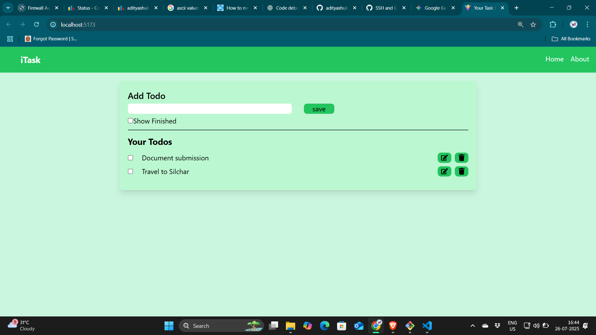
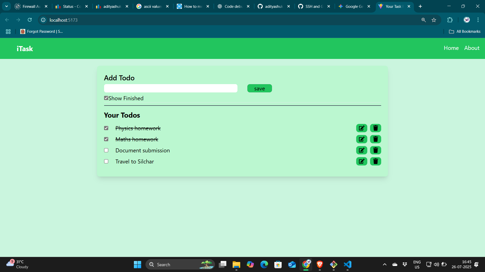

# Todo_react_app
# 📝 iTask - Todo React App

iTask is a sleek, responsive **Todo List App** built using **ReactJS**. It allows users to:
- Create tasks
- Mark them as done
- Edit or delete tasks
- Toggle visibility of completed tasks

It features a clean UI and intuitive controls for a smooth task management experience across devices.

---

## 🚀 Features

- ✅ **Add Todos**: Input and save your tasks easily.
- 📋 **Show Finished Toggle**: Toggle to show/hide completed tasks.
- ✏️ **Edit Tasks**: Update your task with a single click.
- 🗑️ **Delete Tasks**: Remove tasks that are no longer needed.
- 📱 **Responsive Design**: Works smoothly on both desktop and mobile.
- 🌈 **Stylish UI**: Built with Tailwind CSS for a modern look.

---

## 📸 Demo

### ➕ Add and View Todos


### ✅ Show Only Unfinished Tasks


### ✔️ Display Completed Tasks


---

## 🛠️ Tech Stack

- **Frontend**: React.js (with Hooks)
- **Styling**: Tailwind CSS
- **Build Tool**: Vite

---

## 🧑‍💻 Getting Started

### Prerequisites

Make sure you have:

- Node.js and npm installed
- Git installed

### Clone the repo

```bash
git clone https://github.com/adityashuklasun/Todo_react_app.git
cd Todo_react_app
